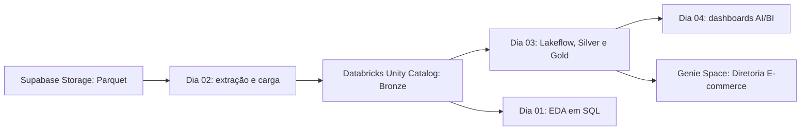

# Projeto E-commerce

Projeto de engenharia e análise de dados desenvolvido em quatro etapas, da exploração inicial ao consumo analítico por dashboards e linguagem natural.

## Visão geral



| Etapa | Foco | Entregas principais |
|---|---|---|
| [Dia 01](dia-01/) | Exploração e perguntas de negócio | Consultas SQL sobre clientes, vendas, canais, receita e estados na camada Bronze. |
| [Dia 02](dia-02/) | Extração e carga (ETL) | Leitura de arquivos Parquet do Supabase Storage compatível com S3 e gravação como tabelas Delta no Databricks. |
| [Dia 03](dia-03/) | Transformação e qualidade | Pipeline Lakeflow, modelos Silver e cinco tabelas Gold, com verificações de qualidade. |
| [Dia 04](dia-04/) | Consumo analítico e IA | Três dashboards executivos, um Genie Space, benchmarks e validação de respostas. |

## Dia 01 - Exploração de dados

A primeira etapa consulta diretamente `projetoecommerce.bronze.clientes` e `projetoecommerce.bronze.vendas` no Databricks SQL. O objetivo é entender a estrutura dos dados e responder perguntas operacionais sem criar uma nova camada.

As análises incluem perfil e localização de clientes, comparação entre RJ e outros estados, receita por venda, maiores transações, desempenho por canal, indicadores gerais e receita por estado usando `JOIN` entre clientes e vendas. A documentação está em [`documentação-dia1.md`](dia-01/documenta%C3%A7%C3%A3odia1.md), [`dashboards.md`](dia-01/dashboards.md) e [`sql_formatado.md`](dia-01/sql_formatado.md).

## Dia 02 - Extração e carga

A segunda etapa implementa o transporte de arquivos Parquet do Supabase Storage para tabelas Delta no Unity Catalog. O Storage é acessado pelo endpoint compatível com S3 usando `boto3`; os dados passam por DataFrames pandas, são convertidos para Spark e gravados na camada Bronze.

- `extract.py` lista objetos e lê arquivos Parquet do bucket.
- `load.py` converte os dados para Spark e grava tabelas Delta.
- `config.py` carrega e valida as configurações do Supabase por variáveis de ambiente.
- `etl_pipeline.py` coordena o mapeamento de arquivos de origem para tabelas de destino.
- `architecture.md` descreve os componentes, requisitos de rede e arquitetura.

As credenciais devem vir de um ambiente local protegido ou Databricks Secrets, nunca ser embutidas no código. A execução requer conectividade de rede do compute Databricks com o Supabase Storage. Consulte o [README do ETL](dia-02/README.md) e a [arquitetura](dia-02/architecture.md) para dependências e uso.

## Dia 03 - Transformação, modelagem e qualidade

A terceira etapa define um bundle Databricks com um pipeline Lakeflow Declarative Pipelines. As transformações Silver preparam clientes, produtos, vendas, receita por canal e preços de concorrentes. A camada Gold oferece tabelas analíticas com grãos e métricas documentados:

- `gold.vendas_temporais`: receita, vendas e itens por data, hora e canal.
- `gold.vendas_produtos`: desempenho e ranking de produtos, identificados por `id_produto`.
- `gold.vendas_detalhadas`: uma linha por venda, enriquecida com produto, cliente, região e segmento.
- `gold.clientes_segmentacao`: receita e compras por cliente e segmento VIP, TOP_TIER ou REGULAR.
- `gold.precos_competitividade`: diferença de preço para concorrentes, classificação e indicador de preço suspeito.

Um job atualiza o pipeline e depois executa verificações de qualidade. Elas cobrem unicidade de chaves, consistência de receita, integridade de dimensões e valores esperados nas tabelas Gold. Falhas interrompem a etapa de verificação. Código, recursos e testes estão em [`dia-03/`](dia-03/), incluindo [`testes_qualidade.py`](dia-03/src/projeto_ecommerce_etl/testes/testes_qualidade.py).

## Dia 04 - Dashboards e Genie

A etapa final publica três dashboards AI/BI: **Diretoria Comercial**, **Diretoria Customer Success** e **Diretoria Pricing**. O Genie Space **Diretoria E-commerce** usa as cinco tabelas Gold para responder perguntas em português e está vinculado aos dashboards pelo botão Ask Genie.

A configuração do Genie é versionada em JSON e inclui metadados e sinônimos de colunas, relações entre tabelas, snippets e exemplos SQL, perguntas sugeridas, benchmarks e instruções de resposta. As instruções fixam o período disponível (13/12/2025 a 11/01/2026), orientam comparações de média diária e separam preços suspeitos dos confirmados. O acesso usa a permissão `CAN_RUN` para o grupo `diretoria-ecommerce`.

O bundle de desenvolvimento foi validado e implantado. Os três dashboards foram publicados e vinculados ao Genie. A avaliação final dos dez benchmarks concluiu com **10/10 corretos**; também foram verificadas seis perguntas de exemplo e duas recusas de segurança. Consulte [`dia-04/README.md`](dia-04/README.md) e [`dia-04/docs/validacao-genie.md`](dia-04/docs/validacao-genie.md) para resultados e detalhes operacionais.

O grupo de acesso foi criado e Daniel é membro. Duas outras contas informadas para a diretoria ainda precisam ser provisionadas no workspace para que possam ser adicionadas ao grupo.

## Estrutura do repositório

```text
ProjetoEcommerce/
|-- dia-01/    # SQL e documentação da EDA
|-- dia-02/    # ETL Supabase Storage -> Delta Lake
|-- dia-03/    # Bundle Lakeflow, transformações e qualidade
|-- dia-04/    # Dashboards, Genie Space e validação
`-- README.md  # Visão geral e etapas do projeto
```

## Segurança e operação

- Não versione chaves, tokens, arquivos `.env` nem credenciais de workspace.
- Armazene segredos em variáveis de ambiente protegidas ou Databricks Secrets.
- Valide bundles antes do deploy e execute os testes de qualidade depois de atualizar os dados.
- Mantenha SQLs de referência, métricas, período analisado e resultados de avaliação documentados junto de cada etapa.
